# Arkit tutorials

## Table of Contents
1. [Downloading Unity Hub](https://github.com/khanniie/Arkit-github#downloading-this-project)
2. [Building to Xcode](https://github.com/khanniie/Arkit-github#building-to-xcode) 
3. [ARkit 2](https://github.com/khanniie/Arkit-github#unity-arkit-2)
    - [General Notes](https://github.com/khanniie/Arkit-github#general-notes)
    - [ARkit Remote](https://github.com/khanniie/Arkit-github#arkit-remote)
    - [Add Anchors Everywhere demo](https://github.com/khanniie/Arkit-github#add-anchors-everywheres)
    - [Add Anchors to Plane demo](https://github.com/khanniie/Arkit-github#add-anchors-to-plane)
    - [Image Anchors demo](https://github.com/khanniie/Arkit-github#image-anchors)
    - [Change Based on Distance demo](https://github.com/khanniie/Arkit-github#change-based-on-distance-from-camera)
    - [Points of Interest demo](https://github.com/khanniie/Arkit-github#particles-on-points-of-interest)
    - [Plane Mesh demo](https://github.com/khanniie/Arkit-github#plane-mesh)
    - [Face Mesh demo](https://github.com/khanniie/Arkit-github#face-mesh)
    - [Face Anchors demo](https://github.com/khanniie/Arkit-github#face-anchors)
    - [Feature Detector demo](https://github.com/khanniie/Arkit-github#feature-detector)

# Downloading This Project #

Download the package from Github,

Or, in the terminal, run
```
git clone https://github.com/khanniie/Arkit-github
```
Then, open the `unity-arkit` folder within the downloaded folder using Unity Hub.

# Building to Xcode
When you're done developing in Unity and want to build the app to your phone, you need to use Xcode to actually build the app on your phone. Xcode is Apple's development tool for their products. Unity can build you an Xcode project, and you can open the folder that is built, open the Xcode project, and build using Xcode, signing with your free account.

These are the steps you will roughly follow:
1. Open the scene you want to build.
2. Open File->Build Settings, and navigate to the iOS panel.
3. Make sure your scene is checked (it should probably be the only one checked, unless you have some sort of navigation between scenes already built.) If you can't find it in the list, try clicking "Add Open Scenes."
4. Then, hit Build on the bottom right.
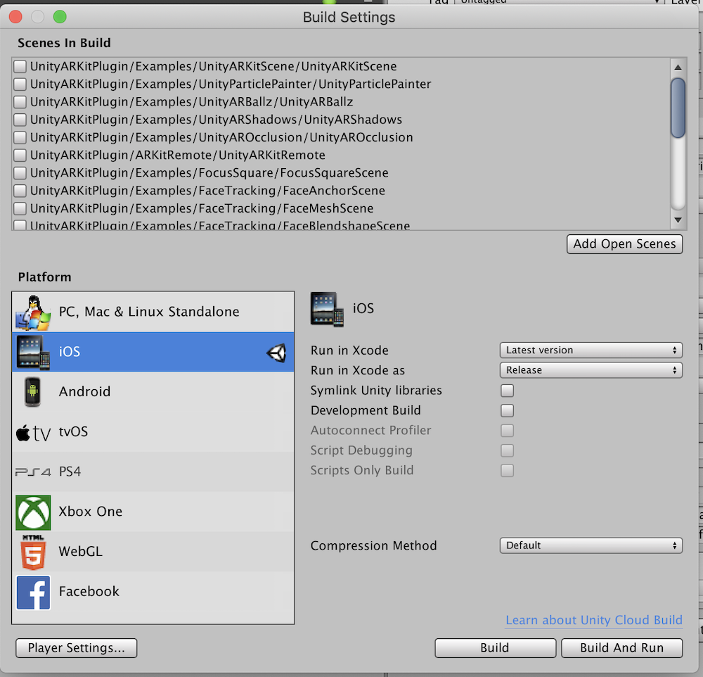
5. Once your project has been built to a folder, open the file with the .xcodeproj extension.
6. Xcode should launch! 
7. Look for the Signing and Capabilities section of Xcode, and sign for your app by selecting Team->[your team]. You may need to register a developer team ("Add an Account") if you don't have one yet.
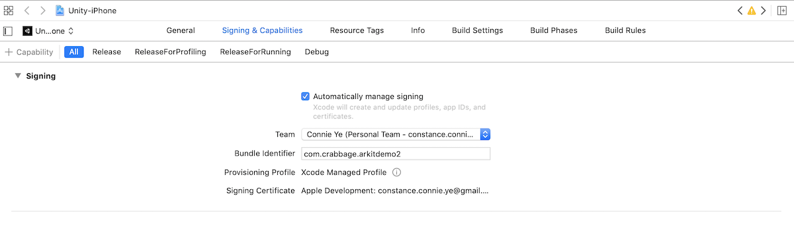
8. If you encounter any "bundle identifier" errors while signing, try changing your bundle identifier to something more distinctive. It should be of the format com.[company name].[appname]. For example, com.crabbage.arkitdemo
9. Click on the run button to build, after selecting your USB connected device from the top left device menu.
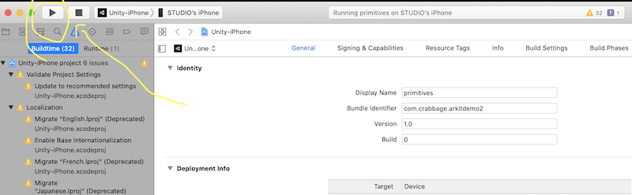

Note: If you want to try the "Build and Run" option, you may be able to, but you need a team ID, which is typically only easy to find if you're using a paid account. There's a [supposed solution here](https://stackoverflow.com/questions/18727894/how-can-i-find-my-apple-developer-team-id-and-team-agent-apple-id), but I haven't verified that it works.

### Player Settings
1. You may want to change the App name and bundle identifier through the Unity Player Settings. These values can also be changed in Xcode on the general page.
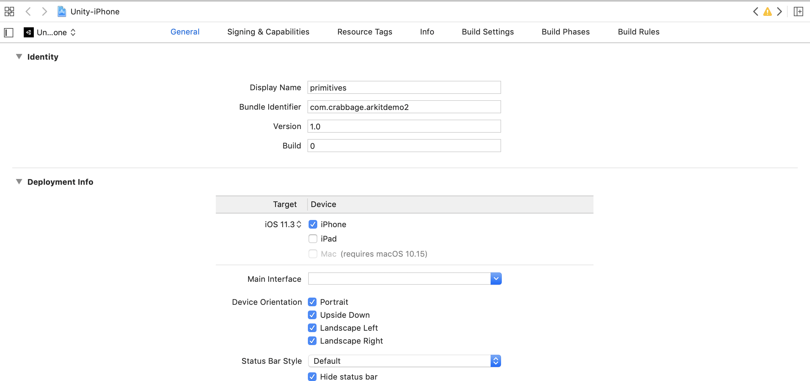

### Xcode troubleshooting
- When you first install your app to your phone, it may not open until you Verify your developer team through General->Device Management on your phone's settings.
- There's a maximum number of bundle names you can register weekly with a free account.

# Unity ARkit 2 

## General Notes

These demos are built with [Unity's Arkit2 Plugin. Their code repository](https://bitbucket.org/Unity-Technologies/unity-arkit-plugin/src/default/) contains detailed information about the API, which events you can subscribe to, and has more complicated demos. The demos presented in this repository are simple, isolated examples of one single functionality. See their repository for examples of other features not explored here, such as world mapping and 3d object tracking.

A lot of demos use anchors, which are defined by Apple's documentation as "A position and orientation of something of interest in the physical environment."

These demos exist with the acknowledgement that the ARkit 2 Plugin is deprecated in favor of AR Foundation; however, Arkit 2 has a functional AR Remote tool, and AR Foundation does not have a reliable one yet, so we are using ARkit 2 here for ease of development. See these slides for [a more complete analysis](https://docs.google.com/presentation/d/1n9gmlFR2trCwu9m41-IdlOhBGr88aBHQTgWS3Q7y8ZU/edit?usp=sharing).

### Requirements
- Unity v2017.4+
- Apple Xcode 10.0+ with latest iOS SDK that contains ARKit Framework
- Apple iOS device that supports ARKit (iPhone 6S or later, iPad (2017) or later)
- Apple iOS 12+ installed on device
- For iOS 13+, you will need the latest Xcode build. However, be warned that Arkit's remote tool breaks on iOS 13.1.3.

### Common GameObjects
- **CameraParent:** A container for the main camera object.
    - **Main Camera:** The camera that renders the scene view, contains two AR scripts that work in the back.
- **ARCameraManager:** Contains the script Unity AR Camera Manager, which contains various AR settings, like Start Alignment, Plane Detection options, Get Point Cloud, Enable Light Estimation, Enable Auto Focus, Environment Texture, Image Tracking and Object Tracking. 
    - This is where you would specify your image targets or object targets.
    - This is also where you can Enable Light Estimation, which adds in a light positioned according to how it percieves the environment, so that your superimposed GameObjects can match the environment better.

### Troubleshooting
The [Issues section](https://bitbucket.org/Unity-Technologies/unity-arkit-plugin/issues?status=new&status=open) of the Unity AR plugin contains a lot of useful information that's useful to read through when you're troubleshooting.

## ARKit Remote

### What is Arkit Remote? 
Arkit remote allows you to test your AR code in the Unity editor, without having to build the entire app. Building an app might take a few minutes, so having a remote tool saves you a lot of time while developing! With Arkit remote, you build the app to your phone, and open the app to stream your phone's camera view to Unity. Then, the editor shows the AR view using the camera information. 

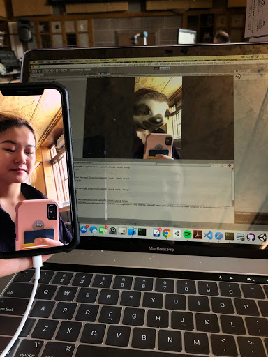

### Building the app
1. Open the “Assets/UnityARKitPlugin/ARKitRemote/UnityARKitRemote” scene.
2. If you are using facetracking, make sure that "uses facetracking" is checked in the ARKit Settings. Select the “Assets/UnityARKitPlugin/Resources/UnityARKitPlugin/ARKitSettings” file and activate the “ARKit Uses Facetracking” check box.
3. Select PlayerSettings (in the menu: Edit/Project Settings/Player) and make sure you have some text in the entry “Camera Usage Description.”
4. Add this scene to the build.
5. Before building, in build settings, turn on development build. Select BuildSettings (in menu File/Build Settings…) and check the Development Build checkbox.
6. Build for iOS as described in the [Building to Xcode](https://github.com/khanniie/Arkit-github#building-to-xcode)!
7. You should now have an app on your phone. When you open it, you will see a flashing black view and nothing else.

There is more detailed information, along with videos, on the [Unity site](https://blogs.unity3d.com/2018/01/16/arkit-remote-now-with-face-tracking/), and [Unity forum](https://forum.unity.com/threads/arkit-support-for-ios-via-unity-arkit-plugin.474385/page-13?_ga=2.253381514.2001220102.1572149175-1852576001.1567539614#post-3153415).

### Using the remote tool
1. Connect the iPhone X to your Mac development machine via USB.
2. Start up the ARKit Remote app on the device.  You should see a “Waiting for connection..” screen.
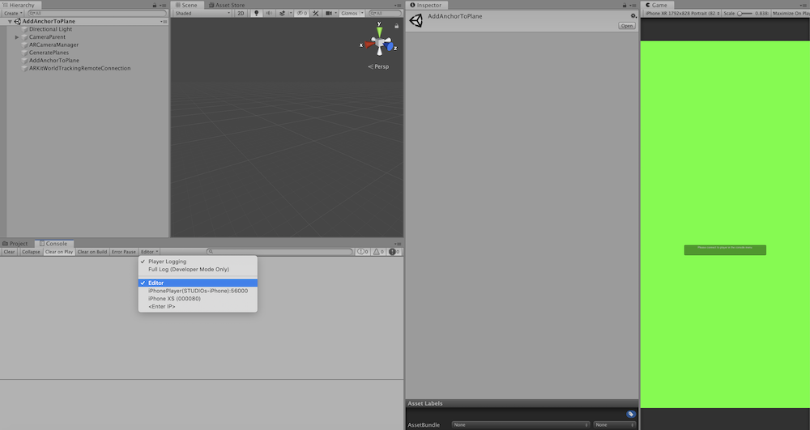
3. In the Unity Editor, connect to your iPhone X by going to your Console Window and selecting the iPhone X connected via USB. The option that works for me usually is iPhone Player, but on a different phone it was iPhone X, so try both and see which one works.
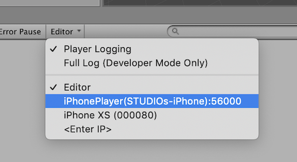
4. Load up one of the examples in the project and press Play in the Editor.
5. You should see a green screen with a button on top that says “Start ARKit Session.” 
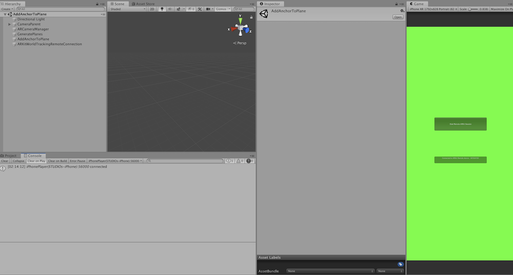
6. Press that button and you should see your camera video feed in your Editor “Game” window.  If your face is in the view it will be sending ARKit Face Tracking data from the device to the Editor as well.
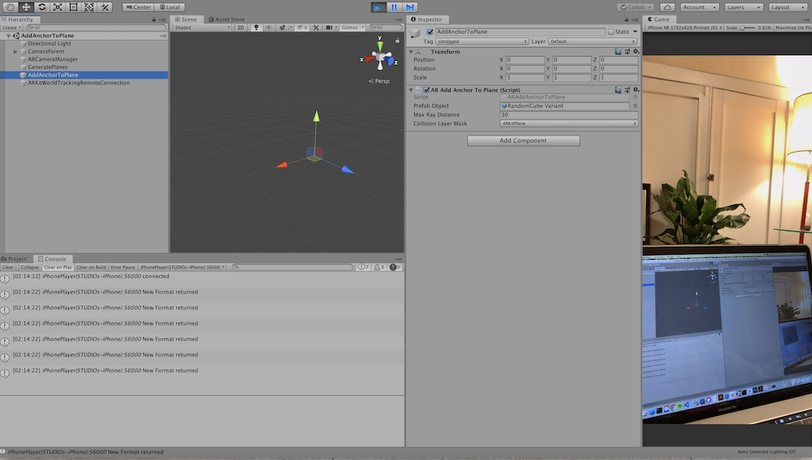

There is more detailed information, along with videos, on the [Unity site](https://blogs.unity3d.com/2018/01/16/arkit-remote-now-with-face-tracking/) and [Unity Forum](https://forum.unity.com/threads/arkit-support-for-ios-via-unity-arkit-plugin.474385/page-13?_ga=2.253381514.2001220102.1572149175-1852576001.1567539614#post-3153415).

### Troubleshooting ARKit Remote
1. Sometimes if just selecting your iphone model doesn't work, you will need to look for the "iphone player" option. *It might help to turn off wifi/internet connection on your phone.* There's some more information [here](https://bitbucket.org/Unity-Technologies/unity-arkit-plugin/issues/73/when-trying-to-use-arkitremote-with-iphone).
2. It's a good idea to make sure your bundle identifier for the arkit remote build is something different than what your actual app will use; otherwise, when your build your actual app to your phone it will overwrite the ARkit remote app and vice versa. For example, you can set your bundle identifier for the Arkit remote app to **com.yourcompanyname.arkitremote** and then future builds of your app could be **com.yourcompanyname.arappdemo**
3. Arkit remote passes info from the ar camera on your phone back to the unity editor; however, IT DOES NOT PASS ALL OF THE INFORMATION to the editor. This means that something could look like it's broken when you're testing in the Unity editor with Arkit remote but not actually be broken. For example, the Image Anchors scene will not work in Arkit remote because image anchor information is not passed through the remote tool. If your app is mysteriously not working or AR objects from the interface have null values, I would build the app and see if it works built on the phone. 
4. I noticed that ARkit Remote broke on iOS 13.1.3, although it works on 13.1.2. If the remote tool is already working on the phone, if possible, I would avoid updating your phone for the duration of the project in case it breaks after you update.
5. When the ArKit remote app is connected, it acts only as a camera. **To interface with your app and see any of the AR, look the Unity Editor on your computer!** Specifically, your "tap" interactions will be click actions on your editor screen, and any gameobjects in your scene will also only show up on the editor screen.
6. Sometimes if I can't find the right device in the editor, I quit the Remote app on my phone and reopen it, repeating until it works.

## Add Anchors Everywhere
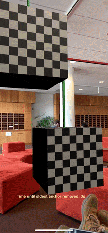

Places a GameObject upon user click/touch. The oldest GameObject will be deleted after "timeuntilremove" number of seconds, which is set to 10 as the default.

### Scripts
- **AddAnchorsEverywhere.cs:** Clones the specified PrefabOject a distance of distanceFromCamera meters forwards, tracks existing objects, and then deletes the oldest one after 10 seconds of inactivity. See inline comments for more specific implementation details. 

### Scene Objects
- **Directional Light:** Adds light to the scene. This illuminates the GameObjects that you put in the scene.
- **CameraParent:** A container for the main camera object.
    - **Main Camera:** The camera that renders the scene view, contains two AR scripts that work in the back.
- **ARCameraManager:** Contains the script Unity AR Camera Manager, which contains various AR configurations.
- **GeneratePlanes:** A script that adds in a mesh where it sees planes. This is mostly for debugging, and you can deactivate this object if you don't want to see the planes.
- **AddAnchorsEverywhere:** Contains the sript, AddAnchorsEVerywhere.cs, that executes most of the game logic.
- **Canvas:** Container for UI elements.
    - **Countdown Indicator:** Text element used to show how many seconds left before an object is deleted.

### Possible Next Steps
- Try changing out the Prefab Object with your own 3d object in AddAnchorsEverywhere! [To make a prefab](https://docs.unity3d.com/Manual/CreatingPrefabs.html), drag and drop a scene gameobject into the project folder view.

## Add Anchors to Plane


Detects horizontal planes in the scene, draws those planes, and upon tap/click, uses [raycasting](https://docs.unity3d.com/ScriptReference/Physics.Raycast.html) to check if and where your tap collides with the AR planes. If there is a collision, it places a new GameObject at that point. 

### Scripts
- **ArAddAnchorToPlane.cs:** Upon tap/click, it shoots out a ray into the scene; if this ray colldies with an AR plane, it creates a new instance of the prefab object and places it upon the spot of collision.

### Scene Objects
- **Directional Light:** Adds light to the scene. This illuminates the GameObjects that you put in the scene.
- **CameraParent:** A container for the main camera object.
    - **Main Camera:** The camera that renders the scene view, contains two AR scripts that work in the back.
- **ARCameraManager:** Contains the script Unity AR Camera Manager, which contains various AR configurations.
- **GeneratePlanes:** A script that adds in a mesh where it sees planes. This is mostly for debugging, and you can deactivate this object if you don't want to see the planes.
- **AddAnchorToPlane:** Contains the sript, ARAddAnchorToPlane.cs, that executes most of the game logic.

### Possible Next Steps
- Try changing out the Prefab Object with your own 3d object in AddAnchorToPlane. [To make a prefab](https://docs.unity3d.com/Manual/CreatingPrefabs.html), drag and drop a scene gameobject into the project folder view.

## Image Anchors
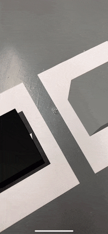

Watches for two specific images, and places game objects upon them if found in camera view.

IMPORTANT NOTE: This demo does not work in the remote tool! You will need to build it to see it work.

### Generating Custom Reference Image Objects
1. To generate reference images, go to Assets->Create->UnityArkitPlugin-> ArReferenceImage
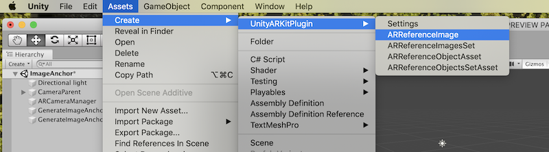
2. Set values for the new item. Image Texture should be your custom image.
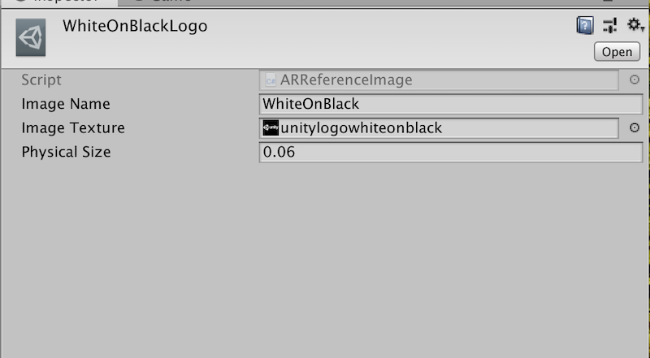
3. Create a reference image set, with Assets->Create->UnityArkitPlugin-> ArReferenceImagesSet
4. Put in the reference images you created.
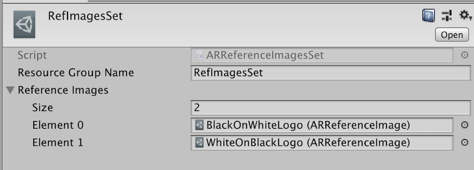
5. The reference images should then be used as values for SetImageAnchor.cs, while the reference image set is used in ARCameraManager.

### Scripts
- **SetImageAnchor.cs:** Upon the AddImageAnchor event, it checks if the image anchor added is equal to referenceImage, and if so, it clones prefabToGenerate and puts the new object upon the image anchor.

### Scene Objects
- **Directional Light:** Adds light to the scene. This illuminates the GameObjects that you put in the scene.
- **Additional Light:** Adds more light to the scene. 
- **CameraParent:** A container for the main camera object.
    - **Main Camera:** The camera that renders the scene view, contains two AR scripts that work in the back.
- **ARCameraManager:** Contains the script Unity AR Camera Manager, which contains various AR configurations.
    - The important field in ARCameraManager is Image Tracking, where you can set which images to track and the maximum number of tracked images.
- **GenerateImageAnchorWhite:** Contains the script, SetImageAnchor.cs, that watches for referenceImage (in this case, WhiteOnBlackLogo), and sets the black cube object upon it when it detects it.
- **GenerateImageAnchorBlack:** Contains the script, SetImageAnchor.cs, that watches for referenceImage (in this case, BlackOnWhiteLogo), and sets the white cube object upon it when it detects it.

### Possible Next Steps
- Try changing out the Prefab Object with your own 3d object. [To make a prefab](https://docs.unity3d.com/Manual/CreatingPrefabs.html), drag and drop a scene gameobject into the project folder view.
- Make your own custom reference images, as described above.

## Change Based on Distance from Camera
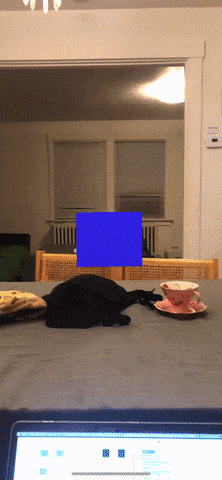 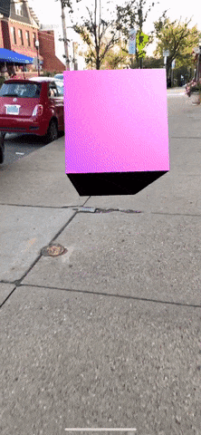

The cube in the scene changes size, color and rotation (in the second gif) based on the distance between it and the camera.

### Scripts
- **ChangeBasedOnDistance.cs:** Calculates the distance between the cube and the main camera, and sets the cube's rotation/size/color according to that value.

### Scene Objects
- **Directional Light:** Adds light to the scene. This illuminates the GameObjects that you put in the scene.
- **Additional Light:** Adds more light to the scene. 
- **CameraParent:** A container for the main camera object.
    - **Main Camera:** The camera that renders the scene view, contains two AR scripts that work in the back.
- **ARCameraManager:** Contains the script Unity AR Camera Manager, which contains various AR configurations.
- **ChangeBasedOnDistance:** Contains the sript, ChangeBasedOnDistance.cs, that executes most of the game logic.
- **White Cube**: The cube in the scene, which changes during the game runtime based on the distance between it and the main camera.

### Possible Next Steps
- Consider remapping the values from distance to size/color/rotation differently.
- Change something other than size/color/rotation.
- Use a different object.
- Instead of using the distance as a gradient, set a threshold value at which an event is triggered.

## Points of Interest
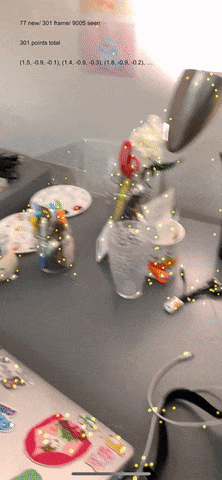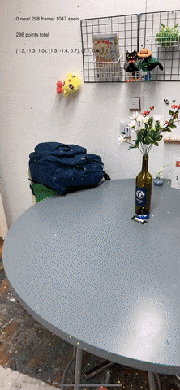

Places glowing points on [points in the world space found through scene analysis during the AR Session](https://developer.apple.com/documentation/arkit/arpointcloud). 

### Scripts
- **PointCloudIds.cs:** Displays the point information on the top left.
- **PointCloudPositions.cs:** Watches the AR Point Cloud data, and feeds it into Point Cloud Particle Prefab to be rendered.

### Scene Objects
- **Directional Light:** Adds light to the scene. This illuminates the GameObjects that you put in the scene.
- **CameraParent:** A container for the main camera object.
    - **Main Camera:** The camera that renders the scene view, contains two AR scripts that work in the back.
- **ARCameraManager:** Contains the script Unity AR Camera Manager, which contains various AR configurations.
- **PointCloudIdsExample:** Contains the script, PointCloudIds.cs, that displays point information in the top left.
- **PointCloudParticleExample**: Contains the script, PointCloudPositions.cs, that renders the point data.

### Possible Next Steps
- Use a different particle system to visualize the points.
- Use the raw position data for something else, rather than feeding the information into a particle system.

## Plane Mesh


### Scene Objects
- **Directional Light:** Adds light to the scene. This illuminates the GameObjects that you put in the scene.
- **CameraParent:** A container for the main camera object.
    - **Main Camera:** The camera that renders the scene view, contains two AR scripts that work in the back.
- **ARCameraManager:** Contains the script Unity AR Camera Manager, which contains various AR configurations.
- **GeneratePlanes:** A script that adds in a mesh where it sees planes. See ARKitPlaneGeometry to see how the mesh is configured and as an example for creating your own plane mesh.

### Possible Next Steps
- Change the plane mesh, change the materials on it or modify it somehow with a vertex shader.
- Place items upon the plane, as demonstrated in the [Add Anchors to Plane demo](https://github.com/khanniie/Arkit-github#add-anchors-to-plane).

## Face Mesh


Places a mesh upon your face.
### Scripts
- **MeshManager.cs:** Takes in information about the [ARFaceGeometry](https://developer.apple.com/documentation/arkit/arfacegeometry), and then passes it to a [Mesh Filter](https://docs.unity3d.com/Manual/class-MeshFilter.html), which passes it to a Mesh Renderer to be rendered. Also grabs vertex 9, which is a point on the nose out of the 1220 vertices given for the face, and places a red sphere at the position of vertex 9. (Some discussion about vertices and hardcoded values is found in this [article.](https://www.raywenderlich.com/5491-ar-face-tracking-tutorial-for-ios-getting-started))

### Scene Objects
- **Directional Light:** Adds light to the scene. This illuminates the GameObjects that you put in the scene.
- **CameraParent:** A container for the main camera object.
    - **Main Camera:** The camera that renders the scene view, contains two AR scripts that work in the back.
- **ARCameraTracker:** Contains the script Unity AR Camera Tracker.
- **MeshManager:** Contains the script, MeshManager.cs, which works as described above.
    - **Sphere:** The "clown nose" that the script MeshManager moves to the position of the user's nose.

### Possible Next Steps
- Change the face mesh somehow, perhaps with a vertex shader or by applying a different material to the mesh under FaceMeshManager->Mesh Renderer.
- Find other vertices of interest upon the face and use their positions for something.

## Primitives On Face (Face Anchors)


Places anchors upon the "center" of the face, and the eyes. 

IMPORTANT NOTE: The eye transforms will not work in the remote tool, so you will need to build to see that part of the app work.

### Scripts
- **PrimitivesOnFace.cs:** Uses face anchor data; grabs leftEyePose, rightEyePose, and the anchorData's transform value (representing the center of the face), and places anchors at those points.

### Scene Objects
- **Directional Light:** Adds light to the scene. This illuminates the GameObjects that you put in the scene.
- **CameraParent:** A container for the main camera object.
    - **Main Camera:** The camera that renders the scene view, contains two AR scripts that work in the back.
- **ARCameraTracker:** Contains the script Unity AR Camera Tracker.
- **PrimitivesOnFace:** Contains the script, PrimitivesOnFace.cs, which works as described above.

### Possible Next Steps
- Switch out the anchors for other objects.

## Feature Detector

 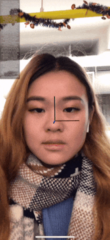   

*Above, Left to right: CheekPuff blendshape, MouthPucker blendshape, TongueOut blendshape, NoseSneerLeft blendshape*

If the [Blendshape](https://developer.apple.com/documentation/arkit/arfaceanchor/2928251-blendshapes) coefficient for the watched feature passes a threshold, a red oval shows up. For example, if the someone puffs their cheeks, and the app is watching the CheekPuff coefficient, a red oval will appear.

### Scripts
- **FeatureDetector.cs:** Checks the value of the feature we are watching; if it is past a threshold, it makes the red oval image visible.
- **BlendShapeGUI.cs:** Prints out the current blendshape coefficients on the top left corner.
- **ARAnchorManager.cs:** Uses the anchorData's transform value (representing the center of the face) to place an anchor object at that position.

### Scene Objects
- **FeatureDetector:** Adds light to the scene. This illuminates the GameObjects that you put in the scene.
- **CameraParent:** A container for the main camera object.
    - **Main Camera:** The camera that renders the scene view, contains two AR scripts that work in the back.
- **ARCameraTracker:** Contains the script Unity AR Camera Tracker.
- **Directional Light:** Adds light to the scene. This illuminates the GameObjects that you put in the scene.
- **Canvas:** Container for UI elements.
    - **Layout:** Layout container for UI elements.
        - **Image:** The red oval that shows up when the coefficient passes a threshold.
- **EventSystem:** Manages the event system for the UI (I'm not sure that it does anything in this case).
- **AnchorManager:** Contains the script ARAnchorManager.cs, which places the anchor at the center of the face.
- **BlendShape GUI:** Contains the script, BlendShapeGUI.cs, which shows the GUI on the top left listing the realtime coefficient values.

# Credit #

A significant portion of the tutorials are adapted from [the Arkit 2 plugin examples, which fall under the MIT license](https://bitbucket.org/Unity-Technologies/unity-arkit-plugin/src/default/LICENSES/MIT_LICENSE).