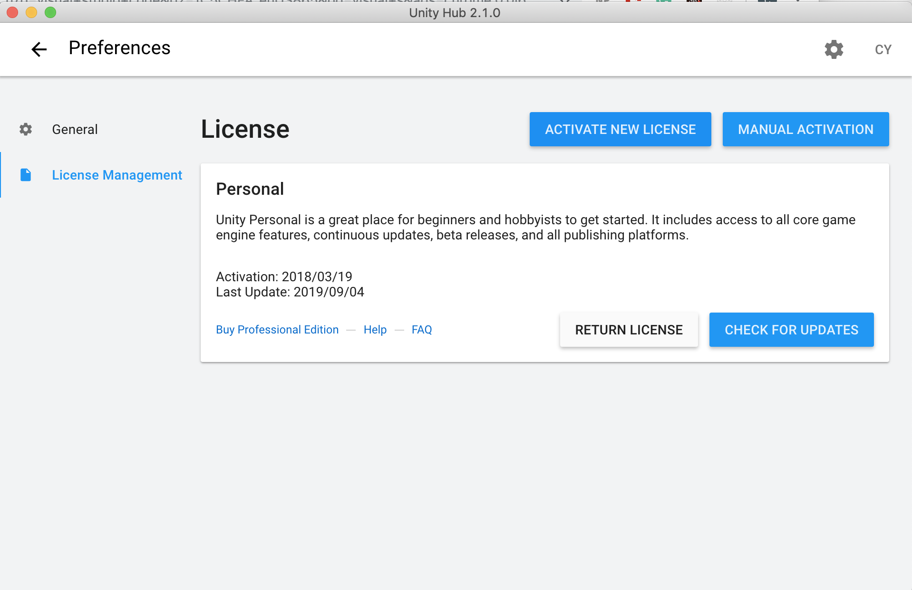
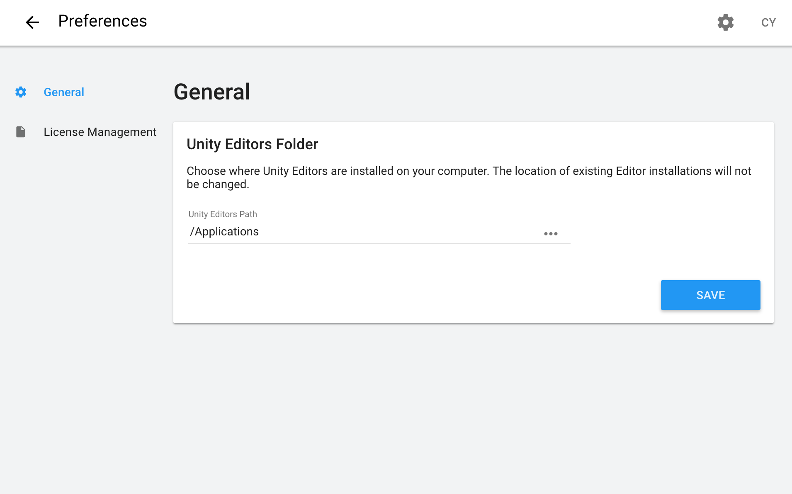
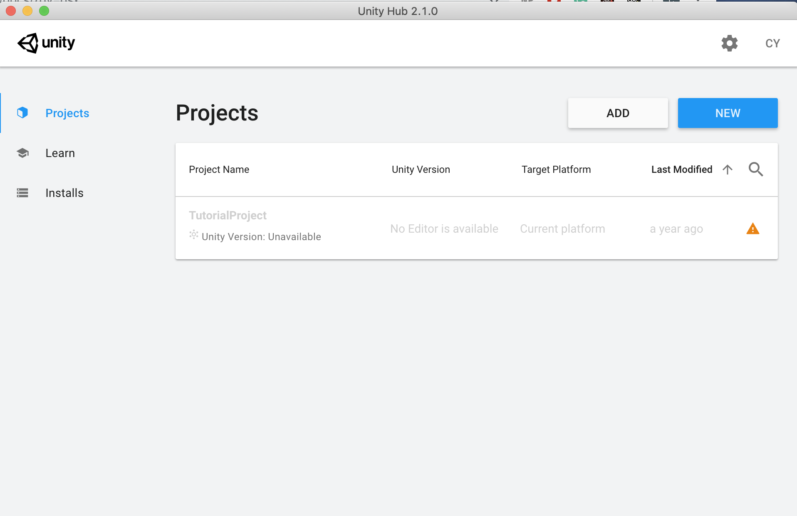
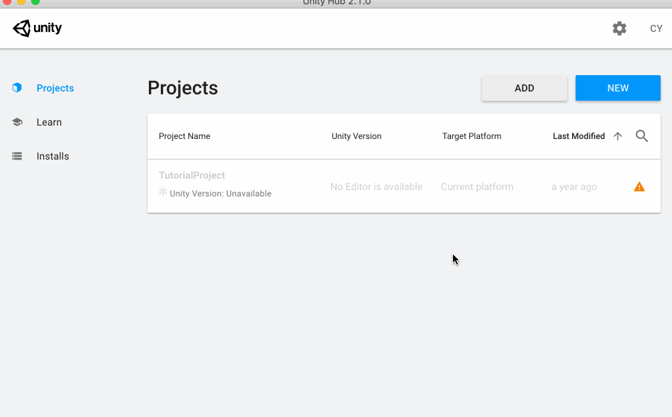
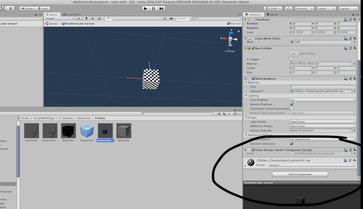

# Arkit tutorials

# download unity hub #
<!-- -> install liscence if they ask

->I would put the install location as Applications if on mac

-> don't download unity just yet

git clone https://github.com/khanniie/arfoundation-samples

 -->

After install 
Open project
(may take a while)

you should now see

# Unity ARkit 2 

## General Notes

These demos are built with [Unity's Arkit2 Plugin. Their code repository](https://bitbucket.org/Unity-Technologies/unity-arkit-plugin/src/default/) contains detailed information about the API, which events you can subscribe to, and has more complicated demos. The demos presented in this repository are simple, isolated examples of one single functionality. See their repository for examples of other features not explored here, such as world mapping and 3d object tracking.

### Requirements
- Unity v2017.4+
- Apple Xcode 10.0+ with latest iOS SDK that contains ARKit Framework
- Apple iOS device that supports ARKit (iPhone 6S or later, iPad (2017) or later)
- Apple iOS 12+ installed on device
- For iOS 13+, you will need the latest Xcode build.

### Common GameObjects
- **CameraParent:** A container for the main camera object.
    - **Main Camera:** The camera that renders the scene view, contains two AR scripts that you don't need to worry about.
- **ARCameraManager:** Contains the script Unity AR Camera Manager, which contains various AR settings, like Start Alignment, Plane Detection options, Get Point Cloud, Enable Light Estimation, Enable Auto Focus, Environment Texture, Image Tracking and Object Tracking. 
    - This is where you would specify your image targets or object targets.
    - This is also where you can Enable Light Estimation, which adds in a light positioned according to how it percieves the environment, so that your superimposed GameObjects can match the environment better.

### Troubleshooting
The [Issues section](https://bitbucket.org/Unity-Technologies/unity-arkit-plugin/issues?status=new&status=open) of the Unity AR plugin contains a lot of useful information that's useful to read through when you're troubleshooting.

### Scripts useful for debugging
- GeneratePlanes: Generates the debug plane view, showing you the planes that the AR plugin has found.

## ARKit Remote

### Building the app
1. Open the “Assets/UnityARKitPlugin/ARKitRemote/UnityARKitRemote” scene.
2. If you are using facetracking, make sure that "uses facetracking" is checked in the ARKit Settings. Select the “Assets/UnityARKitPlugin/Resources/UnityARKitPlugin/ARKitSettings” file and activate the “ARKit Uses Facetracking” check box.
3. Select PlayerSettings (in the menu: Edit/Project Settings/Player) and make sure you have some text in the entry “Camera Usage Description.”
4. Add this scene to the build.
5. Before building, in build settings, turn on development build. Select BuildSettings (in menu File/Build Settings…) and check the Development Build checkbox.
6. Build for iOS! Then build on xCode.
7. You should now have an app on your phone. When you open it, you will see a flashing black view and nothing else.

There is more detailed information, along with videos, on the [Unity site](https://blogs.unity3d.com/2018/01/16/arkit-remote-now-with-face-tracking/), and [Unity forum](https://forum.unity.com/threads/arkit-support-for-ios-via-unity-arkit-plugin.474385/page-13?_ga=2.253381514.2001220102.1572149175-1852576001.1567539614#post-3153415).

### Using the remote tool
1. Connect the iPhone X to your Mac development machine via USB.
2. Start up the ARKit Remote app on the device.  You should see a “Waiting for connection..” screen.
3. In the Unity Editor, connect to your iPhone X by going to your Console Window and selecting the iPhone X connected via USB.
4. Load up one of the examples in the project and press Play in the Editor.
5. You should see a green screen with a button on top that says “Start ARKit Session.” Press that button and you should see your camera video feed in your Editor “Game” window.  If your face is in the view it will be sending ARKit Face Tracking data from the device to the Editor as well.

There is more detailed information, along with videos, on the [Unity site](https://blogs.unity3d.com/2018/01/16/arkit-remote-now-with-face-tracking/) and [Unity Forum](https://forum.unity.com/threads/arkit-support-for-ios-via-unity-arkit-plugin.474385/page-13?_ga=2.253381514.2001220102.1572149175-1852576001.1567539614#post-3153415).

### Troubleshooting ARKit Remote
1. Sometimes if just selecting your iphone model doesn't work, you will need to look for the "iphone player" option. *It might help to turn off wifi/internet connection on your phone.* There's some more information [here](https://bitbucket.org/Unity-Technologies/unity-arkit-plugin/issues/73/when-trying-to-use-arkitremote-with-iphone).
2. It's a good idea to make sure your bundle identifier for the arkit remote build is something different than what your actual app will use; otherwise, when your build your actual app to your phone it will overwrite the ARkit remote app and vice versa. For example, you can set your bundle identifier for the Arkit remote app to **com.yourcompanyname.arkitremote** and then future builds of your app could be **com.yourcompanyname.arappdemo**
3. Arkit remote passes info from the ar camera on your phone back to the unity editor; however, IT DOES NOT PASS ALL OF THE INFORMATION to the editor. This means that something could look like it's broken when you're testing in the Unity editor with Arkit remote but not actually be broken. For example, the Image Anchors scene will not work in Arkit remote because image anchor information is not passed through the remote tool. If your app is mysteriously not working or AR objects from the interface have null values, I would build the app and see if it works built on the phone. 
4. I noticed that ARkit Remote broke on iOS 13.1.3, although it works on 13.1.2. If the remote tool is already working on the phone, if possible, I would avoid updating your phone for the duration of the project in case it breaks after you update.
5. When the ArKit remote app is connected, it acts only as a camera. **To interface with your app and see any of the AR, look the Unity Editor on your computer!** Specifically, your "tap" interactions will be click actions on your editor screen, and any gameobjects in your scene will also only show up on the editor screen.

## Add Anchors Everywhere

Places a GameObject upon user click/touch. The oldest GameObject will be deleted after "timeuntilremove" number of seconds, which is set to 10 as the default.

### Scripts
- **AddAnchorsEverywhere.cs:** Clones the specified PrefabOject a distance of distanceFromCamera meters forwards, tracks existing objects, and then deletes the oldest one after 10 seconds of inactivity. See inline comments for more specific implementation details. 
    - Note: This prefab object should contain the Unity AR User Anchor Component Script already, so that when it is created it interfaces with the AR plugin to register as an anchor. If you are making your own prefab to add, make sure it also already has this script.
    

### Scene Ojects
- **Directional Light:** Adds light to the scene. This illuminates the GameObjects that you put in the scene.
- **CameraParent:** A container for the main camera object.
    - **Main Camera:** The camera that renders the scene view, contains two AR scripts that you don't need to worry about.
- **ARCameraManager:** Contains the script Unity AR Camera Manager, which contains various AR configurations.
- **GeneratePlanes:** A script that adds in a mesh where it sees planes. This is mostly for debugging, and you can deactivate this object if you don't want to see the planes.
- **AddAnchorsEverywhere:** Contains the sript, AddAnchorsEVerywhere.cs, that executes most of the game logic.
- **Canvas:** Container for UI elements.
    - **Countdown Indicator:** Text element used to show how many seconds left before an object is deleted.

## Add Anchors to Plane

## Image Anchors

- to generate reference images, create -> ARKITPLUGIN -> Reference Images

## Change Based on Distance from Camera
 

## Face Mesh

## Particles on Points of Interest

## Plane Mesh

## Face Anchors

## Feature Detector

    

*Above, Left to right: CheekPuff blendshape, MouthPucker blendshape, TongueOut blendshape, NoseSneerLeft blendshape*